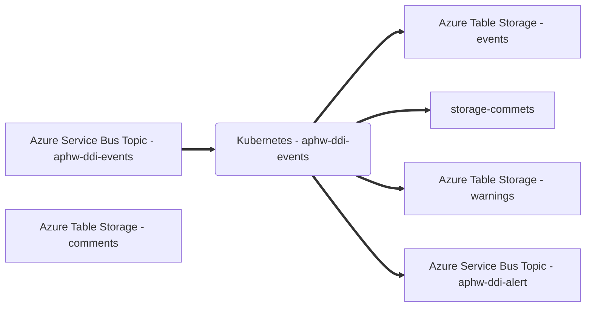

# aphw-ddi-events

Microservice to consume event updates from Dangerous Dogs Index and persist in event store.
 

 
## Prerequisites

- [Azure Service Bus](https://docs.microsoft.com/en-us/azure/service-bus-messaging/)
- [Docker](https://www.docker.com/)
- Either:
  - [Docker Compose](https://docs.docker.com/compose/install/linux/#install-the-plugin-manually)
  - [Docker-Compose (standalone)](https://docs.docker.com/compose/install/other/)

Optional:
- [Kubernetes](https://kubernetes.io/)
- [Helm](https://helm.sh/)

### Configuration

#### Azure Service Bus

This service publishes responses as messages to Azure Service Bus topics.

| Name | Description |
| ---| --- |
| `MESSAGE_QUEUE_HOST` | Azure Service Bus hostname, e.g. `myservicebus.servicebus.windows.net` |
| `MESSAGE_QUEUE_USER` | Azure Service Bus SAS policy name, e.g. `RootManageSharedAccessKey`    |
| `MESSAGE_QUEUE_PASSWORD` | Azure Service Bus SAS policy key |
| `MESSAGE_QUEUE_SUFFIX` | Developer initials, optional, will be automatically added to topic names, e.g. `-jw `|
| `EVENT_TOPIC_ADDRESS` | Azure Service Bus topic name for events, e.g. `aphw-ddi-eventss` |
| `EVENT_SUBSCRIPTION_ADDRESS` | Azure Service Bus subscription name for events, e.g. `dangerous-dogs-index-event-hub` |
| `ALERT_TOPIC_ADDRESS` | Azure Service Bus topic name for events, e.g. `dangerous-dogs-index-alert` |

##### Message schemas

All message schemas are fully documented in an [AsyncAPI specification](docs/asyncapi.yaml).

## Setup

### Configuration

These configuration values should be set in the [docker-compose.yaml](docker-compose.yaml) file or Helm [values file](helm/aphw-ddi-events/values.yaml) if running Kubernetes.

| Name | Description |
| ---| --- |
| `APPINSIGHTS_CLOUDROLE` | Azure App Insights cloud role |
| `APPINSIGHTS_CONNECTIONSTRING` | Azure App Insights connection string |

#### Docker

Docker Compose can be used to build the container image.

```
docker-compose build
```

The service will file watch application and test files so no need to rebuild the container unless a change to an npm package is made.

## How to start the service

The service can be run using the [start](scripts/start) script.
```
./scripts/start
```

This script accepts any Docker Compose [Up](https://docs.docker.com/engine/reference/commandline/compose_up/) argument.

You will need to have a ```.env``` file in the root of this project with the following contents:
```
export MESSAGE_QUEUE_HOST="SNDFFCINFSB1001.servicebus.windows.net"
export MESSAGE_QUEUE_USER="RootManageSharedAccessKey"
export MESSAGE_QUEUE_PASSWORD="<replace-with-password-from-service-bus-access-policy>"
export MESSAGE_QUEUE_SUFFIX="-<replace-with-dev-initials>"
```
### Debugging

A debugger can be attached to the running application using port `9980`.

## How to get an output

The output of this service is an entry or entries added to the Azure Table Storage tables following receipt of a valid
event received from the Azure Service Bus subscription.

Use the [AsyncAPI specification](docs/asyncapi.yaml) to obtain a test input and submit to the Azure Service Bus topic, `aphw-ddi-events`.

You can use the [Azure Storage Explorer](https://azure.microsoft.com/en-gb/features/storage-explorer/) to view the contents of the Azure Table Storage tables.

## How to stop the service

The service can be stopped using the [stop](scripts/stop) script.
```
./scripts/stop
```

The script accepts any Docker Compose [Down](https://docs.docker.com/engine/reference/commandline/compose_down/) argument.

For example, to stop the service and clear all data volumes.
```
./scripts/stop -v
```

## How to test the service

The service can be tested using the [test](scripts/test) script.
```
./scripts/test
```

The script accepts the following arguments:

- `--watch/-w` - run tests with file watching to support Test Driven Development scenarios (TDD)
- `--debug/-d` - run tests in debug mode. Same as watch mode but will wait for a debugger to be attached before running tests.


process.env.AZURE_STORAGE_ACCOUNT_NAME = 'devstoreaccount1'
process.env.AZURE_STORAGE_CONNECTION_STRING = 'UseDevelopmentStorage=true'

# Running a subset of tests outside of Docker
In order to run a single test or group of tests, you can use
```
npm run test <path>/<filename>
```
e.g.
```
npm run test owner.test.js
``` 

However, you will need to copy these lines into your jest.setup.js temporarily, and do not check in any changes to jest.setup.js 

```
process.env.AZURE_STORAGE_ACCOUNT_NAME = 'devstoreaccount1'
process.env.AZURE_STORAGE_CONNECTION_STRING = 'UseDevelopmentStorage=true'
```

## CI pipeline

This service uses the [FFC CI pipeline](https://github.com/DEFRA/ffc-jenkins-pipeline-library).

## Licence

THIS INFORMATION IS LICENSED UNDER THE CONDITIONS OF THE OPEN GOVERNMENT LICENCE found at:

<http://www.nationalarchives.gov.uk/doc/open-government-licence/version/3>

The following attribution statement MUST be cited in your products and applications when using this information.

> Contains public sector information licensed under the Open Government license v3

### About the licence

The Open Government Licence (OGL) was developed by the Controller of Her Majesty's Stationery Office (HMSO) to enable information providers in the public sector to license the use and re-use of their information under a common open licence.

It is designed to encourage use and re-use of information freely and flexibly, with only a few conditions.